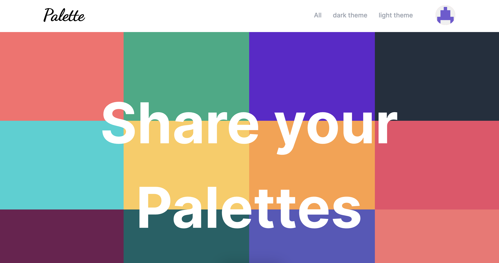
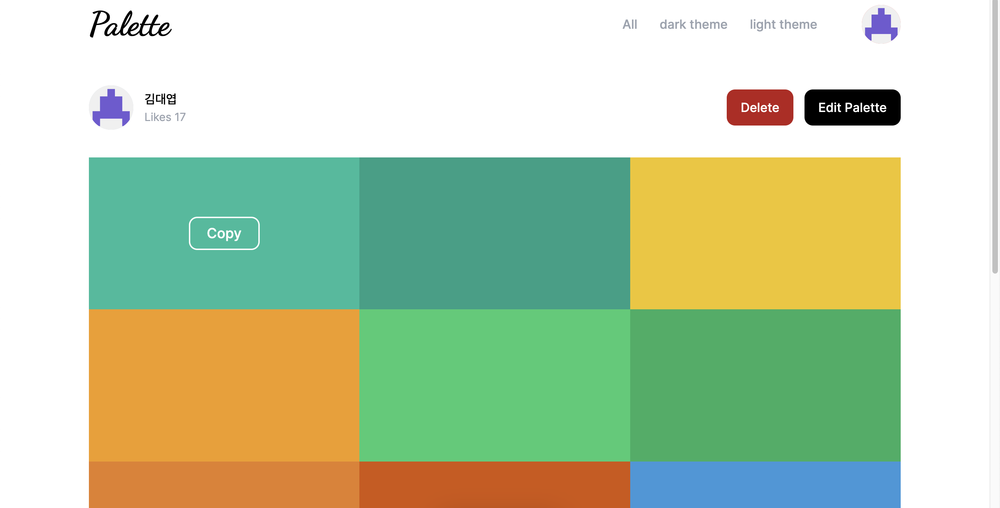
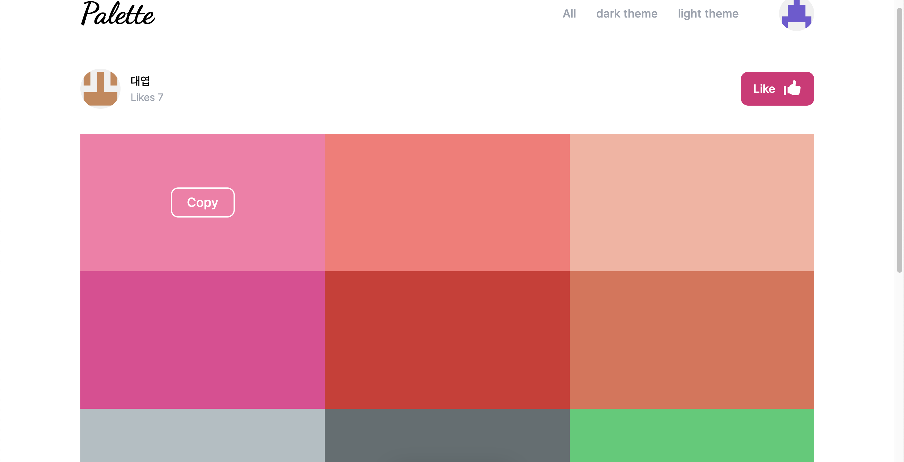
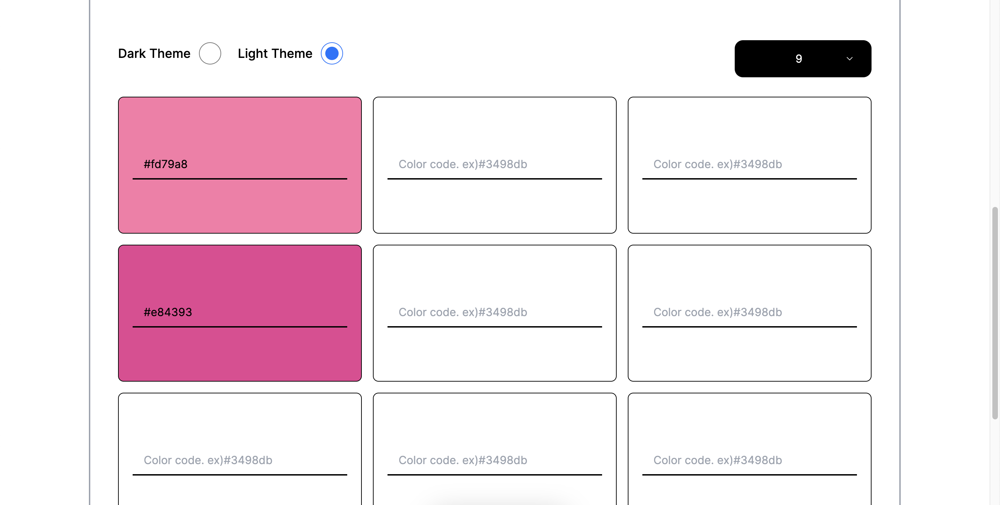

# Color Palette



## 프로젝트 동기

프로젝트를 만들다보면 색상의 조합이 굉장히 중요하다고 생각한다. 어떤 색상을 어떻게 조합을 하느냐에 따라 웹페이지의 느낌이 달라질 수 있기 때문이다. 하지만 대부분의 사람들은 색상조합에 어려움을 가질 것 같아서 좋은 색상들을 그룹으로 묵어서 공유하면 좋을것 같다는 생각에 만들게 되었다.

## 스택

- Next.js
- tailwind.css
- typescript
- next-auth
- mongodb

## 프로젝트 구조

```
$PROJECT_ROOT

│
├── app
│
├── components
│
├── utils
│
├── public
│
└── models
```

## 주요 기능


팔레트의 만든 사람이 팔레트 디테일 페이지에 들어가게 되면 해당 사진처럼 삭제버튼과 팔레트 편집버튼이 화면에 보여지게 만들었습니다.


위 사진은 다른 사람의 팔레트 디테일 페이지에 들어갔을때의 모습입니다. 내가 만든 팔레트와는 다르게며'좋아요' 버튼이 표시되며 해당 버튼을 누를시 만든 사람 이름 밑에 있는 'Likes 숫자'에 1이 더해지게 됩니다.


위 사진은 팔레트를 만드는 페이지로 그리드형식으로 배열된 input박스에 색상 코드를 입력하면 해당 박스의 배경색이 해당 색상코드로 변경되게 만들어서 팔레트를 추가하는 사람이 색상코드가 제대로 입력된건지 확인하기 편하게 만들었습니다.
